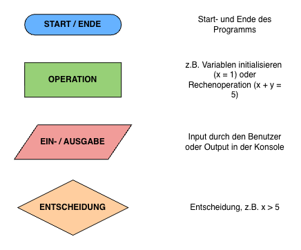
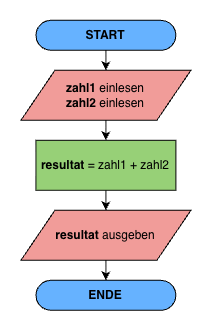

# Variablen & Rechnen (1/2)

## Lernziel
Am Ende dieser Lektion weisst du: wie du Variablen mit korrektem Datentyp deklarierst, wie ein PAP aussieht, wie du Konsoleneingaben konvertierst, und wie du Grundrechenarten, Runden, Inkrementieren, Potenzieren und Modulo korrekt anwendest.

---

## 1. Einstieg

- C# prüft schon beim Kompilieren, ob die Datentypen zusammenpassen – ein falscher Datentyp fällt dir damit früher auf als in vielen anderen Sprachen.
- Wer den Unterschied zwischen `int` und `double` bei einer Division nicht kennt, produziert eines der häufigsten Anfänger-Bugs in C#.
- Alles, was du heute lernst, brauchst du danach in praktisch jedem C#-Programm.

---

## 2. Grundlagen

### A - Variablen & Datentypen

**Variablen deklarieren**

```csharp
int number = 18;
int a, b, c = 5, 3, 2;
```

**Variablennamen**

Variablennamen in lowerCamelCase, keine Sonderzeichen:

| ✅ Erlaubt | ⛔️ Nicht erlaubt |
|---|---|
| number | Number |
| firstName | first-name |
| speedInPercent | speedin% |

**Wichtigste Datentypen**

| Typ | C# | Beispiel |
|---|---|---|
| Zeichenkette | `string` | "Hallo" |
| Ganzzahl | `int` | -5, 0, 54 |
| Fliesskommazahl | `double` | 7.6543 |
| Wahrheitswert | `bool` | true, false |

```csharp
int age = 16;
Console.WriteLine(age.GetType());   // System.Int32
```

**Konvertieren**

`Console.ReadLine()` liefert **immer** einen String.

```csharp
Console.Write("Wie alt bist du? ");
string age = Console.ReadLine();
int ageNumber = int.Parse(age);
```

### B - Rechnen

**Divisionen**

```csharp
Console.WriteLine(6 / 2);     // 3   int / int = int
Console.WriteLine(6 / 4);     // 1   ⚠️ Nachkommastellen gehen verloren!
Console.WriteLine(6 / 4.0);   // 1.5 mindestens ein double nötig
Console.WriteLine(9 % 2);     // 1 (Rest) / Modulo
```

**Runden**

```csharp
Console.WriteLine(Math.Round(3.12568, 2));  // 3.13, auf 2 Stellen gerundet
Console.WriteLine(Math.Round(3.5));  // 4, ab .5 wird aufgerundet, "Bankers-Round"
Console.WriteLine(Math.Floor(3.5));  // 3, wird immer auf die nächste Ganzzahl abgerundet
```

**Inkrementieren & Dekrementieren**

```csharp
int number2 = 18;
number2++;      // 19
number2--;      // 18
```

### C - Programmablaufpläne (PAP)





---

## 3. Übungen

### 1. Variablen und Datentypen
Deklariere drei Variablen: eine Ganzzahl, eine Kommazahl und einen Text. Lasse dir jeweils den Datentyp mit `.GetType()` ausgeben.

### 2. Einfache Ein- und Ausgabe (EVA-Prinzip)
1. Schreibe ein Programm, das deinen Namen einliest und ihn mit einer Begrüssung ausgibt.
2. Erweitere das Programm, so dass es zwei Ganzzahlen einliest und ihre Summe ausgibt.

### 3. Fehler finden
*Finde den Fehler!:*
```csharp
Console.Write("Wie alt bist du? ");
string alter = Console.ReadLine();
int naechstesJahr = alter + 1;
Console.WriteLine("Nächstes Jahr bist du " + naechstesJahr);
```

### 4. String-Operationen
1. Schreibe ein Programm, das deinen Namen nur in Grossbuchstaben oder Kleinbuchstaben ausgibt (Beispiel: `Anna` → `ANNA`). Hier findest du [Hilfe](https://www.w3schools.com/cs/cs_strings.php).
2. Lasse den Benutzer zwei Wörter eingeben und verbinde sie zu einem neuen Wort.

### 5. PAP zeichnen
*PAP-Aufgabe:* Zeichne den PAP für: Der Benutzer gibt seinen Bruttolohn und den Steuersatz (in %) ein. Das Programm berechnet den Nettolohn und gibt ihn aus.

### 6. Code lesen
*Wie lautet der Output?:*
```csharp
int a = 5;
int b = 2;
Console.WriteLine(a / b);
```

### 7. Grundrechenarten
1. Lasse den Benutzer zwei beliebige Zahlen eingeben und gib die Ergebnisse für Addition, Subtraktion, Multiplikation und Division aus. Runde auf 2 Stellen nach dem Komma.
2. **Wissensfrage:** Was ist der Unterschied zwischen einer Division zweier `int`-Werte und einer Division, bei der mindestens ein Operand ein `double` ist?

### 8. Inkrementieren & Dekrementieren
1. Lege eine Variable `x = 5` an. Erhöhe sie um 1, gib das Ergebnis aus. Erniedrige sie dann um 2 und gib das Ergebnis erneut aus.

### 9. Potenzieren, Division & Modulo
1. Ein Protein-Schokoriegel kostet 3.20 Franken. Wie viele Riegel kannst du mit 20 Franken kaufen? Wie viel Geld bleibt übrig?

---

## 4. Weiterführende Beispiele und Gedanken

- Achtung, typische Stolperfalle: Wer zwei `int`-Werte dividiert, ohne an den Datentyp zu denken, verliert automatisch die Nachkommastellen.
- Nächste Lektion: Operatoren (Vergleich, Logisch) sowie komplexere Kombinationsaufgaben.
- Überlege: Welche der heute gezeigten Operationen könntest du bereits jetzt in einem eigenen kleinen Programm einsetzen, z.B. einem Taschenrechner?
